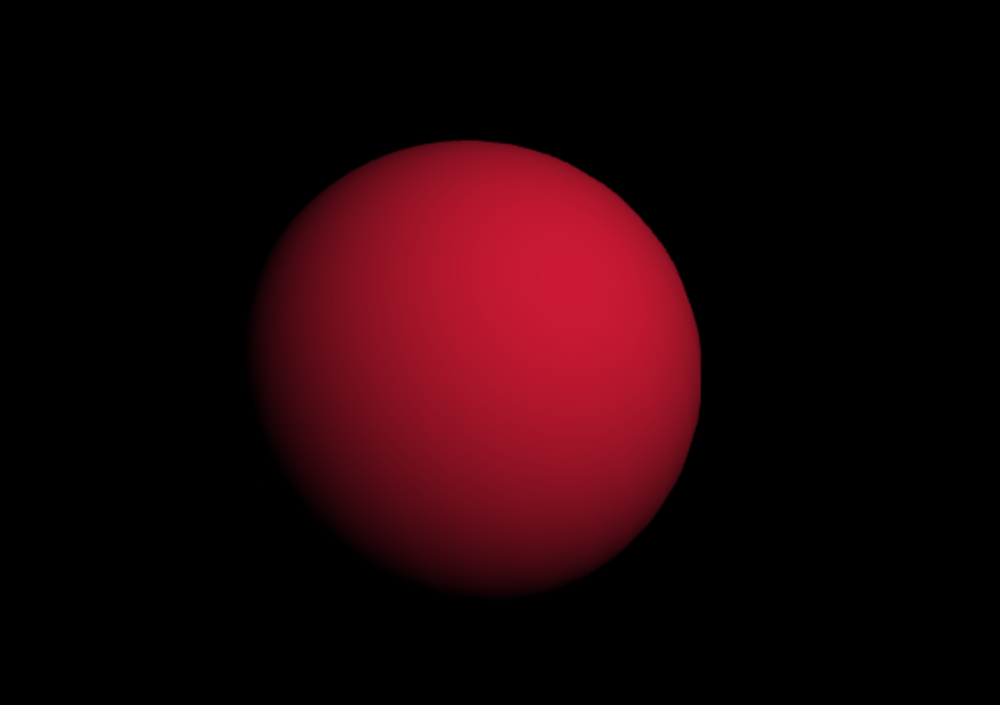

# gl-sphere
Generate all you need to build an webgl sphere based on [stack.gl](http://stack.gl/)
## example




## how to use
```javascript

var createSphere = require("gl-sphere");
var sphere = createSphere(
  gl,
  {
    radius: 3,
    longDivision: 30,
    latDivision: 30,
    position: {x: 0.5, y: -1.0, z: -14.0},
    rotation: {x: 0, y: Math.PI / 3, z: Math.PI / 5},
    color: {r: 0.8, g: 0.1, b: 0.2}
  }
);

/*In your render method*/
render() {
	/*......*/
	shader.uniforms.uModelView = sphere.matrix;
	sphere.vertices.bind();
	shader.attributes.aPosition.pointer();
	sphere.colors.bind();
	shader.attributes.aColor.pointer();
	sphere.normals.bind();
	shader.attributes.aNormal.pointer();
	sphere.indices.bind();
	gl.drawElements(gl.TRIANGLES, sphere.length, gl.UNSIGNED_SHORT, 0);
	/*......*/
}
```

## how to run demo
```
npm install
npm run start-example
```
After running ```npm start```, a wzrd server should start running on [`http://localhost:9966/`](http://localhost:9966/) Enjoy!
